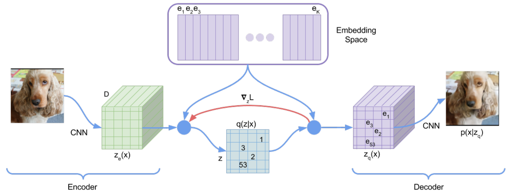
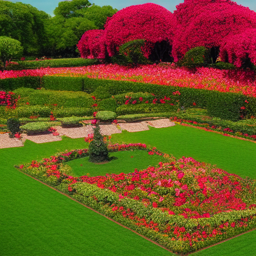

Variational Autoencoder 

Latent Space 

Latent Space represents the parameters of a multivariate distribution

## The Most code Credit Goes to  https://youtu.be/ZBKpAp_6TGI?si=IfdaqaKfjnOnCyEX 

## And the The Code for it is https://github.com/hkproj/pytorch-stable-diffusion 

## Where I modified the code to see intermediate images in it 

## here I used pretrained model from the Links 

# stable-diffusion
PyTorch implementation of Stable Diffusion from scratch

## Download weights and tokenizer files:

1. Download `vocab.json` and `merges.txt` from https://huggingface.co/runwayml/stable-diffusion-v1-5/tree/main/tokenizer and save them in the `data` folder
2. Download `v1-5-pruned-emaonly.ckpt` from https://huggingface.co/runwayml/stable-diffusion-v1-5/tree/main and save it in the `data` folder

## fine-tuned models:

Just download the `ckpt` file from any fine-tuned SD (up to v1.5).

1. InkPunk Diffusion: https://huggingface.co/Envvi/Inkpunk-Diffusion/tree/main
2. Illustration Diffusion (Hollie Mengert): https://huggingface.co/ogkalu/Illustration-Diffusion/tree/main

## Special thanks

Special thanks to the following repositories:

1. https://github.com/CompVis/stable-diffusion/
1. https://github.com/divamgupta/stable-diffusion-tensorflow
1. https://github.com/kjsman/stable-diffusion-pytorch
1. https://github.com/huggingface/diffusers/

### Sample images 

